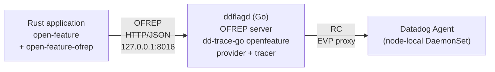
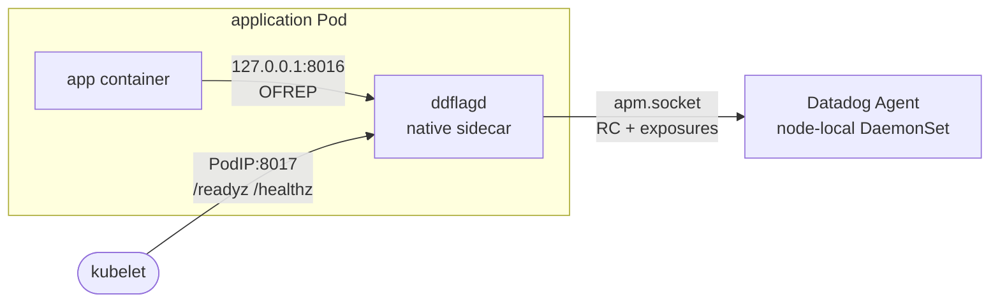
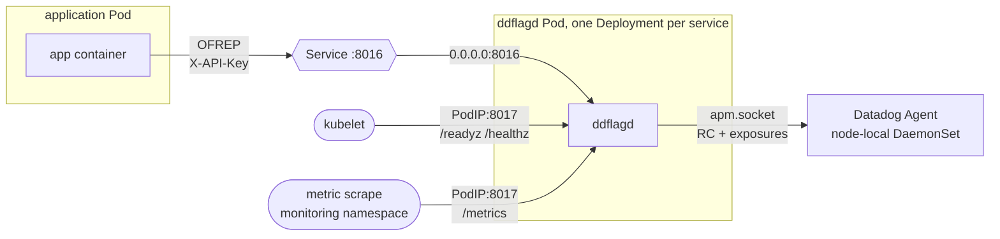

# ddflagd

ddflagd is an OpenFeature daemon that lets any language evaluate Datadog Feature Flags, backed by Datadog's official Go SDK. Rust is the first target.

The flag configuration, the evaluation and the telemetry all stay inside that SDK; ddflagd converts between it and the protocol the caller arrives on, which today is [OFREP](https://openfeature.dev/docs/reference/other-technologies/ofrep/).



## What you need on the application side

Nothing from this project. ddflagd speaks OFREP, so a caller uses whatever OFREP provider its language already has, configured with the bridge's address and otherwise untouched.

Three things are asked of the caller, and all of them hold whatever the language is:

- **Treat an error as "use the value in my own code".** A provider reports a failure, an unready bridge, and a deliberate code default the same way, and running on the code default is correct in all three.
- **Bound the call yourself if the provider does not.** ddflagd bounds its own response time, but that does not cover a connection that stalls after it is established, and not every OFREP provider has an overall request timeout.
- **Keep the evaluation context flat and primitive.** Datadog supports flat primitive attributes only. A nested field typically reaches the wire as whatever the provider decided to stringify it into, so it arrives at Datadog as a meaningless attribute that neither the provider nor ddflagd can catch.

### For example, in Rust

The two official crates, and nothing else:

```toml
[dependencies]
open-feature = { version = "0.3", default-features = false }
open-feature-ofrep = "0.1"
```

```rust
use std::time::Duration;
use open_feature::{EvaluationContext, OpenFeature};
use open_feature_ofrep::{OfrepOptions, OfrepProvider};

let provider = OfrepProvider::new(OfrepOptions {
    base_url: std::env::var("DDFLAGD_URL")
        .unwrap_or_else(|_| "http://127.0.0.1:8016".into()),
    connect_timeout: Duration::from_millis(50),
    ..Default::default()
})
.await?;
OpenFeature::singleton_mut().await.set_provider(provider).await;
let client = OpenFeature::singleton().await.create_client();

let ctx = EvaluationContext::default()
    .with_targeting_key(tenant_id)
    .with_custom_field("region", region);

let enabled = tokio::time::timeout(
    Duration::from_millis(250),
    client.get_bool_value("new-query-planner", Some(&ctx), None),
)
.await
.ok()                 // the timeout
.and_then(Result::ok) // a connection failure, an unready bridge, a code default, a type mismatch
.unwrap_or(false);
```

Where the three promises land here: `unwrap_or(false)` is the first, `tokio::time::timeout` is the second, since `open-feature-ofrep` 0.1 configures only a connect timeout, and `EvaluationContextFieldValue::Struct` is what the third rules out, because the crate sends it as its debug form.

One more thing specific to this crate: add `open_feature_ofrep=warn` to the `tracing` subscriber. It logs at error level for a code default and for a 503, both of which are normal here.

`rust-integration/` pins all of this against a running ddflagd, so a crate update that changes any of it is caught there.

## Running it

The container image is `ghcr.io/tailor-platform/ddflagd`, built for `linux/amd64` and `linux/arm64` with SLSA provenance and an SPDX SBOM attached. Verify it with `gh attestation verify`.

Kubernetes manifests are in [`deploy/sidecar`](deploy/sidecar) and [`deploy/deployment`](deploy/deployment). Start with the sidecar; the Deployment layout trades the sidecar's isolation for independent deployment, and needs one Deployment per consuming service.

In the sidecar layout the evaluation listener never leaves the Pod, and only the operational listener is bound to the Pod IP, because a kubelet `httpGet` probe arrives there and not on loopback.



The Deployment layout moves the evaluation listener onto the Pod network, published through a Service; the operational listener stays on the Pod IP, unpublished, for kubelet and for metric scraping.



`ddflagd --help` prints the same configuration summary, and `ddflagd --version` reports the release. There are no configuration flags: the `DD_` variables are read by the official SDK itself, and a flag alongside them would make the effective configuration depend on which of the two won.

### Configuration

| Variable | Default | Meaning |
| --- | --- | --- |
| `DD_EXPERIMENTAL_FLAGGING_PROVIDER_ENABLED` | required, `true` | Enables the official provider. Without it, the official constructor hands back a provider that evaluates nothing, so ddflagd refuses to start. |
| `DD_SERVICE` | required | The **consuming** service's name. It is what the exposure events and the evaluation metrics are recorded under. |
| `DD_ENV` / `DD_VERSION` | | The consuming service's environment and version. |
| `DD_TRACE_AGENT_URL` | `http://localhost:8126` | The Agent. A Unix socket is `unix:///var/run/datadog/apm.socket`. `DD_AGENT_HOST` plus `DD_TRACE_AGENT_PORT` works too. |
| `DD_REMOTE_CONFIG_POLL_INTERVAL_SECONDS` | `5` | How often the flag configuration is polled, which is most of the propagation delay of a flag change. |
| `DD_METRICS_OTEL_ENABLED` | unset | Enables the `feature_flag.evaluations` metric. Needs `OTEL_EXPORTER_OTLP_ENDPOINT` to point at a collector or at the Agent's OTLP intake. |
| `DD_FLAGGING_EVALUATION_COUNTS_ENABLED` | `true` | Sends evaluation counts to the Agent. |
| `DD_APM_TRACING_ENABLED` | `false`, set by ddflagd | Runs the tracer as a transport for another product's data. An explicit setting is left alone. |
| `DDFLAGD_LISTEN_ADDR` | `127.0.0.1:8016` | The evaluation listener. `0.0.0.0:8016` for a Deployment. |
| `DDFLAGD_ADMIN_ADDR` | `0.0.0.0:8017` | The operational listener. Not loopback, because kubelet probes the Pod IP. |
| `DDFLAGD_HANDLER_TIMEOUT` | `200ms` | Bounds one evaluation. Over it, 503. |
| `DDFLAGD_INIT_TIMEOUT` | `30s` | How long to wait for the first flag configuration before exiting. |
| `DDFLAGD_DRAIN_DELAY` | `5s` | After SIGTERM, how long to keep answering while readiness is already failing. `0s` for a sidecar. |
| `DDFLAGD_SHUTDOWN_TIMEOUT` | `10s` | The budget for draining and the final telemetry flush. |
| `DDFLAGD_API_KEY` | unset | When set, requires a matching `X-API-Key` on the evaluation listener. |
| `DDFLAGD_PPROF_ENABLED` | `false` | Exposes `/debug/pprof` on the operational listener. |

`DD_TRACE_ENABLED=false` is rejected: the tracer carries the Remote Configuration client that feeds the provider. `DD_APM_TRACING_ENABLED=false` is the setting that keeps APM data out, and it is the default here.

### Endpoints

The evaluation listener and the operational listener are separate on purpose. In a sidecar the evaluation listener is bound to loopback, while a kubelet `httpGet` probe arrives on the Pod IP; one listener would mean exposing evaluation to the Pod network just to be probed.

| Listener | Path | Purpose |
| --- | --- | --- |
| evaluation, `8016` | `POST /ofrep/v1/evaluate/flags/{key}` | Single flag evaluation with a dynamic context. |
| evaluation, `8016` | `POST /ofrep/v1/evaluate/flags` | Bulk evaluation. Answers 501: it carries a static context and targets client-side SDKs. |
| operational, `8017` | `GET /healthz` | Liveness. Independent of the Agent and of the provider, so an Agent outage cannot cause a restart loop. |
| operational, `8017` | `GET /readyz` | Readiness and startup. 200 once the provider holds a flag configuration and the process is not shutting down. |
| operational, `8017` | `GET /metrics` | Prometheus format. |
| operational, `8017` | `GET /debug/status` | Versions, state, evaluation counts by outcome, the last error, and the effective configuration with the shared secret redacted. |

### The flag configuration in memory

The provider holds the whole flag configuration for `DD_SERVICE` in memory and evaluates against it locally. An evaluation never reaches the Agent or Datadog, so evaluation latency does not depend on either being up. Remote Configuration replaces the held configuration wholesale at `DD_REMOTE_CONFIG_POLL_INTERVAL_SECONDS`.

What that means when the Agent stops answering:

- **A failed poll changes nothing.** A connection error, a non-200, an empty response, all leave the held configuration untouched. Evaluation keeps running on the configuration last received, for as long as the process lives. Nothing expires it.
- **Readiness stays green through it.** Dropping out of the Service would send every caller to its code default, which is worse than evaluating against a configuration that is minutes old.
- **Exposure events and evaluation counts are lost, not queued.** A failed send drops them, so the Feature Flags UI goes quiet while evaluation is still correct.
- **A restart during the outage is fatal.** The configuration is never written to disk, so a restarted process has nothing to evaluate against and exits after `DDFLAGD_INIT_TIMEOUT`. An Agent outage is survivable while running and not survivable across a rolling update, so wait it out before deploying.

The Agent keeps its own on-disk Remote Configuration cache, so Datadog being unreachable from a live Agent is not the same outage as the Agent being unreachable from ddflagd; only the latter is the one described here.

Nothing is held on the caller's side either. An OFREP provider is a remote evaluation provider and keeps no configuration, so every evaluation falls back to the code default for as long as ddflagd is restarting.

One state has no probe behind it. If the configuration is withdrawn upstream rather than merely undelivered, the provider clears what it holds and every evaluation answers the code default, while readiness stays 200 because the process is working exactly as designed. The `outcome` breakdown of `ddflagd_evaluations_total` is what shows it.

### Metrics

| Metric | Type | Labels |
| --- | --- | --- |
| `ddflagd_evaluations_total` | counter | `outcome`: `value`, `code_default`, `flag_not_found`, `invalid_request`, `not_ready`, `timeout`, `error` |
| `ddflagd_evaluation_duration_seconds` | histogram | `outcome` |
| `ddflagd_provider_ready` | gauge | |
| `ddflagd_provider_ready_timestamp_seconds` | gauge | |
| `ddflagd_build_info` | gauge | `version`, `dd_trace_go_version` |

`outcome` is the metric that matters. A caller cannot tell a deliberate code default from a failure, because `open-feature-ofrep` 0.1 reports both as an error, so the share of evaluations that fell back is monitored here rather than in the application.

Configuration freshness is not exposed. The official provider keeps its configuration private and emits no events, so ddflagd cannot observe it; watch the Agent's Remote Configuration state and the Feature Flags UI instead.

## Development

```
make test        # unit and contract tests
make e2e         # e2e and conformance tests, against Datadog's fake Agent in docker
make rust-test   # the official Rust crates against ddflagd
make lint
make build
```

`make e2e` runs a real ddflagd process against [`dd-apm-test-agent`](https://github.com/DataDog/dd-apm-test-agent), the fake Agent Datadog uses in every tracer's CI. It delivers the flag configuration over Remote Configuration and receives the exposure events, so nothing about either has to be reimplemented here, and no Datadog account is involved. The suite starts the container itself through testcontainers, so a Docker daemon is the only prerequisite; set `DDFLAGD_TEST_AGENT_URL` to point it at an Agent you are already running instead.

The conformance suite runs every case of [`ffe-system-test-data`](https://github.com/DataDog/ffe-system-test-data), Datadog's cross-language evaluation fixtures, through OFREP. It is not a test of the evaluation logic, which belongs to the official SDK; it checks that the request conversion and the OFREP mapping preserve the value and the reason of every case.

The submodule at `testdata/ffe-system-test-data` is pinned to the commit the dd-trace-go release under test pins, and is bumped together with dd-trace-go rather than on its own. The fixtures run ahead of the shipped SDK: upstream `main` currently carries semver operators the v2.10.1 evaluator does not implement, and expects a malformed flag to evaluate to `PARSE_ERROR` where v2.10.1 answers `DEFAULT`. Pinning to what the SDK pins is what keeps the suite a statement about ddflagd rather than about Datadog's release order. To find the right commit for a dd-trace-go version:

```
gh api repos/DataDog/dd-trace-go/contents/openfeature/ffe-system-test-data?ref=vX.Y.Z --jq .sha
```

`testdata/ofrep/openapi.yaml` is the OFREP OpenAPI document (version 0.3.0), vendored so the contract test is reproducible offline.

## License

MIT. See [LICENSE](LICENSE).
